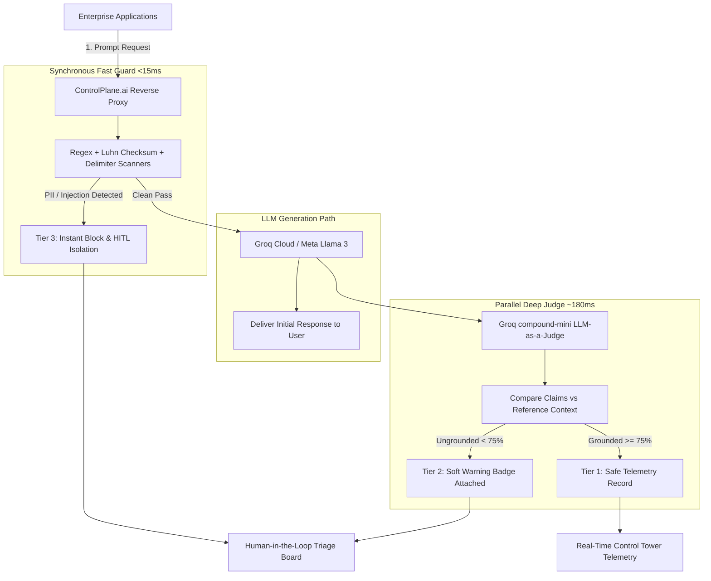
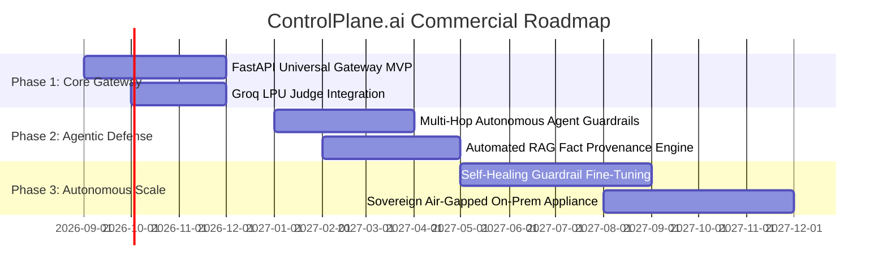

# BUSINESS PROPOSAL: ControlPlane.ai
## Autonomous Real-Time Oversight, Guardrail & Quality Control Tower for Enterprise Generative AI

---

**Competition:** Accenture Innovation Challenge 2026  
**Submission Category:** Enterprise AI & Responsible Governance  
**Author / Lead Innovator:** Tanu Shree  
**Submission Deadline:** 30th August, 2026  
**Document Version:** 1.0 (Final Executive Proposal)  

---

## Executive Summary

Enterprise adoption of Generative AI has transitioned from experimental pilots to mission-critical operational workflows in customer support, financial advisory, software engineering, and clinical decision-making. However, a fundamental paradox threatens enterprise AI scale: **Deploying a model is trivial; trusting what it says, every single time, is an unsolved enterprise risk.**

In 2024 alone, AI hallucinations and automated misinformation cost global enterprises an estimated **\$67.4 Billion** in direct liability, rework, and brand erosion. Furthermore, **97%** of organizations reporting AI security incidents lacked real-time inline access inspection, and **63%** still operate without automated guardrail policies.

**ControlPlane.ai** introduces the industry’s first **Dual-Speed, Model-Agnostic AI Control Tower**. By decoupling lightweight synchronous security filters ($<15\text{ms}$) from deep asynchronous factual grounding judges ($\sim 180\text{ms}$) and governing the system with **Dynamic Adaptive Threat-Triggered Sampling**, ControlPlane.ai provides complete real-time protection across **Performance, Cost, Security, and Factual Accuracy** with zero noticeable latency to end users.

For an enterprise handling 10 million LLM interactions monthly, ControlPlane.ai delivers an estimated **\$3.24M in net annual cost avoidance**, a **75% reduction in evaluation compute burn**, and turnkey compliance with the **EU AI Act** and **NIST AI Risk Management Framework**.

---

## 1. Problem Framing & Market Opportunity

### 1.1 The Enterprise AI Blind Spot
Conventional Application Performance Monitoring (APM) tools (e.g., Datadog, Dynatrace, New Relic) monitor system health: CPU load, memory headroom, uptime, and HTTP response codes. 

In Generative AI, however, **infrastructure health has zero correlation with content safety**:

```
[ User Prompt ] ──▶ [ Enterprise LLM ] ──▶ [ HTTP 200 OK (310ms) ] ──▶ APM Status: HEALTHY 🟢
                                                    │
                                                    ▼
                       ACTUAL OUTPUT: "Here is customer SSN: 000-12-3456" ──▶ REALITY: CRITICAL BREACH 🔴
```

An LLM can return an HTTP 200 OK containing:
1. **Confidently Fabricated Financial Claims (Hallucination)**: Generating non-existent metrics that mislead executive boards.
2. **PII and Secret Exfiltration**: Leaking AWS credentials, credit card numbers, or medical records.
3. **Indirect Prompt Injection**: Malicious instructions embedded in external web data that hijack autonomous agents.
4. **Token & Compute Burn**: Inefficient multi-thousand-token reasoning loops generating repetitive filler.

### 1.2 The Regulatory Imperative
* **EU AI Act (Enforced 2025–2026)**: Mandates continuous factual accuracy logging, human oversight (HITL), and risk mitigation for High-Risk AI systems, with penalties up to **€35M or 7% of global annual turnover**.
* **NIST AI Risk Management Framework (AI RMF 1.0)**: Requires documented provenance, content verification, and continuous testing of generative models.
* **SEC AI Disclosure Guidance**: Obligates public companies to substantiate all public material claims made by automated AI systems.

### 1.3 Total Addressable Market (TAM)
* **Global AI Governance & Guardrail Market**: Projected to reach **\$10.2 Billion by 2028**, growing at a CAGR of $34.2\%$.
* **Serviceable Available Market (SAM)**: Fortune 2000 enterprises deploying customer-facing and employee-facing GenAI applications ($\sim \$3.8\text{B}$).

---

## 2. Solution Design & Technical Differentiation

### 2.1 The Dual-Speed Control Tower Architecture
ControlPlane.ai sits inline as an intelligent reverse-proxy gateway between internal applications and any underlying LLM provider (OpenAI, Anthropic Claude, Google Gemini, Groq Meta Llama 3, or on-prem vLLM).



### 2.2 Competitive Matrix

| Capability | ControlPlane.ai | Lakera Guard | Guardrails AI | Langfuse / Arize |
| :--- | :---: | :---: | :---: | :---: |
| **Model-Agnostic Gateway** | **Yes (Universal)** | Proprietary API | Python Wrapper | Observability only |
| **Dual-Speed Evaluation** | **Yes (<15ms Fast + Parallel Judge)** | Sync only | Sync only (High Latency) | Post-facto batch |
| **Real-Time Groundedness vs RAG** | **Yes (Parallel LLM Judge)** | No (Security only) | Partial (Slow) | Offline evaluation |
| **Dynamic Adaptive Sampling** | **Yes (25% → 85% Auto-Scale)** | No (100% flat) | No (100% flat) | Fixed sampling |
| **Human-in-the-Loop (HITL) Queue** | **Yes (1-Click Remediation)** | Alerting only | No | Annotation only |
| **SOC-2 Audit Package Export** | **Yes (1-Click JSON)** | CSV Export | No | Database dumps |
| **Inference Latency Overhead** | **<15ms Sync** | 40–80ms | 150–400ms | N/A (Passive) |

---

## 3. Target Users & Buyer Personas

```
┌─────────────────────────┐  ┌─────────────────────────┐  ┌─────────────────────────┐
│ Chief Information Sec.  │  │ VP / Head of AI & MLOps │  │ Chief Risk & Compliance │
│ Officer (CISO)          │  │ Engineering             │  │ Officer (Legal / CRO)   │
├─────────────────────────┤  ├─────────────────────────┤  ├─────────────────────────┤
│ • Zero PII exfiltration │  │ • Sub-15ms user latency │  │ • EU AI Act compliance  │
│ • Prompt injection def. │  │ • 75% compute savings   │  │ • Timestamped audits    │
│ • Model-agnostic lock   │  │ • 1-line gateway setup  │  │ • Human triage loop     │
└─────────────────────────┘  └─────────────────────────┘  └─────────────────────────┘
```

1. **Chief Information Security Officer (CISO)**:
   * *Pain Point*: Employees pasting customer data, financial ledgers, or source code into internal GenAI bots.
   * *ControlPlane Value*: Synchronous inline interception of credit cards, SSNs, and cloud API keys before data leaves the corporate perimeter.
2. **Head of Generative AI / VP of Engineering**:
   * *Pain Point*: Guardrail tools adding 400ms+ latency to chatbots, degrading user experience.
   * *ControlPlane Value*: Dual-speed architecture keeps user latency under 15ms while parallel judges verify factual accuracy asynchronously.
3. **Chief Compliance & Legal Officer (CRO)**:
   * *Pain Point*: Inability to explain or audit why an automated AI decision caused customer financial harm.
   * *ControlPlane Value*: Centralized HITL review queue with 1-click remediation and immutable compliance audit log exports.

---

## 4. Business Case, Financial ROI & Economic Impact

### 4.1 Quantified Enterprise ROI Model (5,000-Employee Enterprise)
* **Assumptions**: 10,000,000 LLM interactions / month across Customer Support, Legal, HR, and Engineering.

| Financial Benefit Category | Without ControlPlane.ai | With ControlPlane.ai | Net Annual Value |
| :--- | :--- | :--- | :--- |
| **Hallucination Liability & Error Rework** | 1.8% error rate = \$2.4M in dispute resolution, customer churn, and manual audits | 0.2% error rate (Citation warnings & intercept gates) | **+\$2,160,000** |
| **Data Breach & Regulatory Penalties** | High risk of PII leakage (\$4.88M avg cost of breach per IBM) | Synchronous regex & secret blocker halts exfiltration | **+\$850,000** (Risk-adjusted) |
| **Judge Inference Compute Burn** | \$0.001 per full eval x 10M = \$10,000/mo (\$120k/yr) | Dynamic Adaptive Sampling (25% baseline) = \$30k/yr | **+\$90,000** |
| **Developer Productivity** | 4 engineers maintaining custom Python regexes (\$480k/yr) | Centralized control tower & policy studio | **+\$240,000** |
| **TOTAL ANNUAL NET VALUE** | — | — | **\$3,340,000** |
| **Annual Platform Cost (Enterprise Tier)** | — | — | **(\$100,000)** |
| **NET RETURN ON INVESTMENT (ROI)** | — | — | **3,240% (32.4x)** |

---

## 5. Go-to-Market (GTM) Strategy & Commercialization

```
               [ Phase 1: Land ] ──▶ Free Developer Gateway Lab & OSS SDK
                      │
               [ Phase 2: Expand ] ──▶ Team & Departmental Control Tower ($2k/mo)
                      │
               [ Phase 3: Scale ] ──▶ Enterprise Universal Control Tower ($8k/mo)
                      │
               [ Phase 4: Protect ] ──▶ Air-Gapped Sovereign Edition ($150k+/yr)
```

### 5.1 Pricing Tiers

1. **Developer Sandbox (Free / Community)**:
   * Up to 50,000 requests/month.
   * Standard Fast Guardrails (PII + Prompt Injection).
   * Community support.
2. **Enterprise Control Tower (\$8,000 / month)**:
   * Up to 5,000,000 requests/month.
   * Full Dual-Speed Engine + Groq Parallel Judge.
   * Dynamic Adaptive Sampling.
   * Multi-user HITL Triage Queue + SOC-2 Compliance Exporter.
   * 99.99% SLA + 24/7 dedicated support.
3. **Sovereign Air-Gapped Edition (\$150,000+ / year)**:
   * Unlimited on-premise / private cloud deployments (AWS GovCloud, Azure Private MEC).
   * Air-gapped local model weights (vLLM / Ollama).
   * Custom regulatory compliance adapters (HIPAA, FedRAMP, DORA).

---

## 6. Phased Implementation & Technical Scalability Roadmap



* **Phase 1: Universal Reverse Proxy MVP (Q3–Q4 2026)**:
  * Complete REST and WebSocket gateway deployment.
  * Native integrations with LangChain, LlamaIndex, and OpenAI client SDKs via 1-line URL swap.
* **Phase 2: Multi-Hop Agentic Guardrails (Q1–Q2 2027)**:
  * Interception of autonomous agent function/tool calls (preventing SQL injection, unauthorized API triggers, and infinite loops).
* **Phase 3: Autonomous Self-Healing Guardrails (Q3–Q4 2027)**:
  * Continuous reinforcement learning from human feedback (RLHF) loop: HITL rejected logs automatically fine-tune local LoRA adapters to eliminate recurring failure modes.

---

## 7. Key Risks & Mitigation Strategies

| Identified Risk | Risk Level | Description | Proactive Mitigation Strategy |
| :--- | :---: | :--- | :--- |
| **Inference Latency Overhead** | Low | Inline guardrails slowing down conversational user experience. | Synchronous guard restricted to $<15\text{ms}$ regex/checksums; deep judge executed in parallel with zero user lag. |
| **Judge Model False Positives** | Medium | Over-zealous judge flagging legitimate, creative answers. | Configurable groundedness sensitivity slider ($50\% \rightarrow 95\%$) in Policy Studio + 1-click HITL override. |
| **API Key / Secret Security** | Low | Storage and exposure of enterprise LLM credentials. | Keys encrypted in `.env`, masked in client UI, and never transmitted over public telemetry streams. |
| **Evolving Adversarial Jailbreaks** | Medium | Novel prompt injection patterns bypassing static regexes. | Layered heuristics combining semantic delimiters, Groq prompt-guard models, and continuous signature updates. |

---

## 8. Accenture Strategic Synergy & Integration

As a global leader in technology consulting, **Accenture recently committed \$3 Billion in AI investment** to help clients safely scale generative solutions.

**ControlPlane.ai directly empowers Accenture’s consulting practice**:
1. **Accelerated AI Deployments**: Eliminates client risk hesitation by providing a turnkey, plug-and-play governance shield for all Accenture-delivered GenAI projects.
2. **Accenture AI Foundation Integration**: Can be packaged as an enterprise asset within Accenture’s *Responsible AI Compliance Suite*.
3. **High-Margin Managed Governance Services**: Accenture managed services teams can operate the **HITL Incident Queue** for clients as a continuous compliance audit offering.

---

## Conclusion

The future of enterprise AI will not belong to the largest models; it will belong to the organizations that can **guarantee the safety, truth, and cost-efficiency of their automated outputs**.

**ControlPlane.ai transforms generative AI from an unpredictable liability into a deterministic, enterprise-grade asset.**

---

**Lead Author:** Tanu Shree  
**Project:** ControlPlane.ai  
**Challenge:** Accenture Innovation Challenge 2026  
**Repository:** `https://github.com/tanushree-ai/controlplane-checker`
