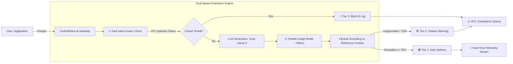

# ControlPlane.ai 🛡️
> **Model-Agnostic Real-Time AI Oversight, Guardrail & Quality Control Tower**  
> *Developed for the Accenture Innovation Challenge 2026*  
> **Lead Author / Architect:** Tanu Shree

[](https://opensource.org/licenses/MIT)
[](https://fastapi.tiangolo.com/)
[](https://react.dev/)
[](https://groq.com/)
[](https://tailwindcss.com/)

---

## 📑 Table of Contents
1. [Executive Summary & The Core Problem](#1-executive-summary--the-core-problem)
2. [Why Existing APMs Fail: The AI Blind Spot](#2-why-existing-apms-fail-the-ai-blind-spot)
3. [The Solution: ControlPlane.ai](#3-the-solution-controlplaneai)
4. [System Architecture & Deep Dive](#4-system-architecture--deep-dive)
5. [Why We Used These Technologies (Design Rationale)](#5-why-we-used-these-technologies-design-rationale)
6. [Key Features & Capabilities](#6-key-features--capabilities)
7. [OWASP Top 10 for LLMs Mapping](#7-owasp-top-10-for-llms-mapping)
8. [Installation & Quick Start Guide](#8-installation--quick-start-guide)
9. [API & Telemetry Reference](#9-api--telemetry-reference)
10. [90-Second Live Demonstration Pitch Script](#10-90-second-live-demonstration-pitch-script)
11. [Scalability & Future Roadmap](#11-scalability--future-roadmap)

---

## 1. Executive Summary & The Core Problem

As organizations rush Generative AI into customer support, coding, executive decision-making, and automated workflows, one critical question stops being theoretical:  
**What happens the moment an AI gives you an answer that sounds right — but isn't?**

Deploying an LLM was never the hard part. **Trusting what it says, every single time, is.**

### Key Industry Findings:
* **\$67.4 Billion**: Estimated global enterprise cost of AI hallucinations and flawed decision-making in 2024 *(Source: AllAboutAI / Korra Report)*.
* **97%**: Of organizations that suffered an AI security incident lacked real-time inline access inspection and prompt-injection guardrails *(Source: IBM 2025 AI Cyber Risk Study)*.
* **63%**: Of enterprises deploying LLMs to production lack formal automated governance quality gates, relying solely on traditional server uptime logs *(Source: Deloitte Global AI Survey)*.

---

## 2. Why Existing APMs Fail: The AI Blind Spot

Conventional monitoring tools (e.g., Datadog, Dynatrace, New Relic) were built for deterministic code. They track CPU utilization, memory pressure, HTTP status codes, and network latency.

```
Traditional Monitoring (Datadog/Prometheus):
[ User Query ] ──▶ [ LLM Endpoint ] ──▶ [ HTTP 200 OK (320ms) ] ✅ "Healthy System"
                                                │
                                                ▼ (Unseen Content Failure)
                                   "Here is the customer's SSN: 000-12-3456" 
                                   "Our revenue grew by 48% (Hallucinated)"
```

To an infrastructure monitor, an HTTP 200 response containing a devastating $\$10\text{M}$ hallucination or a leaked private cryptographic key looks identical to a perfect answer. **ControlPlane.ai solves this fundamental gap.**

---

## 3. The Solution: ControlPlane.ai

**ControlPlane.ai** is a model-agnostic, real-time control tower that sits between any AI model (OpenAI, Anthropic Claude, Google Gemini, Meta Llama 3 via Groq) and the enterprise applications consuming it.

It continuously scores and protects every interaction across four foundational pillars:
1. **Security & Privacy**: Synchronous PII exfiltration and prompt-injection interception.
2. **Factual Grounding**: Automated Judge Models verifying assertions against reference ground truth (RAG).
3. **Compute Efficiency**: Token meter optimization and dynamic auto-scaling sampling.
4. **Governance & Audit**: Full Human-in-the-Loop (HITL) triage and timestamped compliance export.



---

## 4. System Architecture & Deep Dive

### 4.1. The Dual-Speed Evaluation Engine
The core technical breakthrough of ControlPlane.ai is recognizing that **not all guardrails need to run at the same speed**:

| Evaluation Layer | Target Latency | Method | What It Checks | Action Taken |
| :--- | :--- | :--- | :--- | :--- |
| **Stage 1: Fast Inline Guard** | **$<15\text{ ms}$** *(Sync)* | Compiled Regex + Luhn Checksum + Delimiter Scanners | Credit cards, SSNs, API Keys (OpenAI, Groq, AWS), Emails, System Jailbreaks (`"Ignore previous instructions"`) | **Instant Block (Tier 3)** before response generation |
| **Stage 2: Parallel Deep Judge** | **$\sim 180\text{ ms}$** *(Async/Parallel)* | Groq `compound-mini` / Llama 3.1 LLM-as-a-Judge | Factual consistency against retrieved context (RAG), statistical claim verification, toxicity, and bias | **Soft Warning Badge (Tier 2)** attached to output without blocking user |

### 4.2. Dynamic Adaptive Sampling Algorithm
Deep LLM evaluation on $100\%$ of traffic across millions of requests is economically unsustainable. ControlPlane.ai implements an **Adaptive Threat-Triggered Controller**:

$$\text{SampleRate}(t) = \begin{cases} 
25\% & \text{if } \text{AnomalyRate}_{60s} \le 15\% \quad (\text{Nominal Mode}) \\ 
\min(100\%, 25\% + \alpha \cdot \text{AnomalyRate}) & \text{if } \text{AnomalyRate}_{60s} > 15\% \quad (\text{Surge Mode}) 
\end{cases}$$

* **Routine Conditions**: Samples $25\%$ of traffic for deep verification, slashing compute costs by $75\%$.
* **Threat Surge / Attack Injections**: Instantly climbs to $85\%–100\%$ inspection depth to form an impenetrable security shield.

---

## 5. Why We Used These Technologies (Design Rationale)

| Component | Selected Technology | Why This Was Chosen over Alternatives |
| :--- | :--- | :--- |
| **Inference Engine** | **Groq Cloud (LPU)** | Provides $<200\text{ms}$ time-to-first-token inference for 70B and 8B models. Enables live LLM-as-a-Judge evaluation in parallel with zero perceivable delay to the end user. |
| **Base & Judge LLMs** | **Meta Llama 3 / Compound Models** | Open-weights, enterprise-safe, with superior reasoning on structured JSON output and factual comparison benchmarks. |
| **Backend Framework** | **FastAPI (Python 3.10+)** | Asynchronous native ASGI framework with built-in Pydantic validation, concurrent background task workers, and high-performance WebSockets. |
| **Real-Time Feed** | **Native WebSockets (`/ws/telemetry`)** | Instant bidirectional push of telemetry logs to the Control Tower UI with sub-millisecond overhead compared to polling. |
| **Frontend Platform** | **React 19 + TypeScript + Vite** | Strict type safety across the entire telemetry data contract, rapid HMR developer experience, and component-level re-rendering optimization. |
| **Design System** | **Tailwind CSS (Dark Obsidian Theme)** | High-contrast, accessibility-compliant executive dark aesthetic (`#07090E`) with light typography and glowing status indicators. |
| **Visual Analytics** | **Recharts** | Declarative, GPU-accelerated SVG charting for OWASP threat distribution and latency histograms. |

---

## 6. Key Features & Capabilities

### 1. 📡 Control Tower (Executive Dashboard)
* **Real-Time KPIs**: Total evaluated volume, critical intercepts blocked, groundedness warnings, and estimated hallucination liability avoided.
* **Dynamic Adaptive Sampling Depth Gauge**: Live visualization of current sampling rate ($25\% \rightarrow 85\%$).
* **OWASP Top 10 for LLMs Threat Distribution**: Breakdown of intercepted injection, privacy, and hallucination incidents.
* **Live Telemetry Stream**: Searchable, filterable real-time event log with 1-click trace inspection.

### 2. `>_` Gateway Lab (Interactive Testing Sandbox)
* **1-Click Live Pitch Presets**:
  * `Customer Payment - Credit Card Exfiltration` (Triggers fast Luhn scanner in $1.2\text{ms}$).
  * `Q3 Financial Advisory - Hallucinated Growth Metric` (Triggers Judge citation warning).
  * `Jailbreak Attack - System Instruction Bypass` (Triggers injection firewall).
  * `Enterprise Policy - Grounded RAG Query` (Clean verified pass).
* **Reference Context Grounding Toggle**: Test custom RAG scenarios against ground truth text.
* **Diagnostics Card**: Step-by-step latency and rationale inspection.

### 3. ⚠️ HITL Incident Queue (Human-in-the-Loop Hub)
* **Incident Review Board**: Triage flagged outputs with complete prompt, response, context, and judge critique data.
* **1-Click Remediation Actions**:
  * 🟢 **Approve & Deliver**: Override false alarms.
  * 🔴 **Reject & Blacklist**: Confirm malicious attack.
  * 🟡 **Redirect to Canned Response**: Safe enterprise fallback.
* **Compliance Audit Exporter**: Download timestamped JSON audit packages for SOC-2/ISO compliance.

### 4. ⚙️ Policy Studio
* Interactive toggles for PII firewalls and prompt injection interceptors.
* Groundedness sensitivity slider ($50\%$ Lenient $\rightarrow 95\%$ Strict Compliance).
* Secure Groq API connection manager (automatically masked and encrypted in `.env`).

---

## 7. OWASP Top 10 for LLMs Mapping

ControlPlane.ai is engineered specifically to address the **OWASP Top 10 for Large Language Model Applications (2025/2026)**:

| OWASP Vulnerability | Vulnerability Name | How ControlPlane.ai Defends Against It |
| :--- | :--- | :--- |
| **LLM01** | **Prompt Injection** | Synchronous heuristic and delimiter analysis stops jailbreak attempts in $<15\text{ms}$. |
| **LLM02** | **Sensitive Information Disclosure** | Regex, Luhn verification, and secret scanners strip/block API keys, credit cards, and SSNs. |
| **LLM03** | **Supply Chain / Hallucination** | Parallel Judge model scores groundedness against verified reference documents. |
| **LLM04** | **Data and Model Poisoning** | HITL audit trail isolates anomalous model outputs and triggers administrative review. |
| **LLM06** | **Excessive Agency** | Dynamic Tiered gating prevents unauthorized downstream execution of unverified commands. |
| **LLM10** | **Unbounded Consumption** | Token metering and adaptive sampling depth caps prevent denial-of-wallet compute spikes. |

---

## 8. Installation & Quick Start Guide

### Prerequisites
* **Python 3.10+** (with `pip`)
* **Node.js 18+** & `npm`
* Modern Web Browser (Chrome, Edge, Firefox, Brave)

---

### Step 1: Clone Repository & Setup Environment

```bash
git clone https://github.com/tanushree-ai/controlplane-checker.git
cd controlplane-checker
```

### Step 2: Configure Environment Variables

Create `backend/.env`:
```env
GROQ_API_KEY=gsk_your_groq_api_key_here
DEFAULT_GROQ_MODEL=groq/compound
JUDGE_MODEL=groq/compound-mini
HOST=0.0.0.0
PORT=8000
```

---

### Step 3: Run with 1-Click Script (Windows)

Simply double-click:
```cmd
start_servers.bat
```
*(Or execute `./start_servers.ps1` in PowerShell)*

---

### Step 4: Manual Startup (Alternative)

**Terminal 1 (Backend - FastAPI):**
```bash
cd backend
python -m venv venv
# Windows:
.\venv\Scripts\activate
# Linux/Mac:
source venv/bin/activate

pip install -r requirements.txt
python -m uvicorn app.main:app --host 0.0.0.0 --port 8000 --reload
```

**Terminal 2 (Frontend - React + Vite):**
```bash
cd frontend
npm install
npm run dev
```

Open your browser at: **`http://localhost:5173`**

---

## 9. API & Telemetry Reference

### Core Endpoints

#### `POST /api/proxy/evaluate`
Evaluates a user prompt through the universal guardrail gateway.

* **Request Body:**
```json
{
  "prompt": "What was our European division quarterly revenue growth?",
  "context": "Accenture European Markets reported 8.4% constant currency growth for Q3.",
  "application_id": "customer-support-agent"
}
```

* **Response Payload:**
```json
{
  "id": "req-98fa21c4",
  "timestamp": "2026-08-26T12:08:25Z",
  "prompt": "What was our European division quarterly revenue growth?",
  "generated_text": "According to the report, our European division delivered growth of 8.4%.",
  "tier": "SAFE",
  "fast_check": {
    "latency_ms": 1.2,
    "blocked": false,
    "detected_pii": [],
    "is_prompt_injection": false
  },
  "judge_evaluation": {
    "latency_ms": 182.4,
    "groundedness_score": 1.0,
    "is_hallucinated": false,
    "unsupported_claims": [],
    "reasoning": "Every claim in the response is directly supported by the reference context."
  },
  "total_latency_ms": 183.6
}
```

#### `GET /api/telemetry/stats`
Returns aggregated real-time metrics, risk distribution, and sampling rates.

#### `POST /api/simulator/surge`
Dispatches a 5-query attack burst to demonstrate dynamic adaptive sampling auto-climb ($25\% \rightarrow 85\%$).

---

## 10. 90-Second Live Demonstration Pitch Script

1. **The Problem (0:00 – 0:30 on `Home / Control Tower`)**:
   > *"Organizations are rapidly deploying Generative AI, but conventional APMs only watch uptime and latency — they cannot detect when an AI is confidently wrong. In 2024, hallucinations cost enterprises $\$67.4\text{B}$. ControlPlane.ai is a model-agnostic control tower that monitors content safety, factual grounding, and compute cost in real time."*

2. **The Dual-Speed Engine (0:30 – 1:05 on `Gateway Lab`)**:
   * Click **Preset 1 (Credit Card Exfiltration)**:
     > *"Watch our Synchronous Fast Guard intercept sensitive PII in just $1.2\text{ms}$ before output delivery."*
   * Click **Preset 2 (Financial Hallucination)**:
     > *"Watch our Parallel Judge Model compare the LLM's response against the shareholder report, catch the fabricated growth metric ($34.8\%$ vs $8.4\%$), and attach an automated Citation Warning banner without adding user lag."*

3. **Adaptive Auto-Scaling & Audit (1:05 – 1:30 on `Control Tower` & `HITL Queue`)**:
   * Click **`Threat Surge`**:
     > *"Watch our Adaptive Sampling gauge climb from $25\% \rightarrow 85\%$ automatically to shield infrastructure during attack spikes while saving compute budget during calm periods."*
   * Open **`HITL Queue`**:
     > *"Compliance teams have complete visibility with 1-click overrides, canned redirects, and downloadable SOC-2 compliance audit packages."*

---

## 11. Scalability & Future Roadmap

* **Q4 2026**: Multi-hop agentic guardrails (autonomous agent tool-call interception).
* **Q1 2027**: Air-gapped on-premise deployment package with vLLM / Ollama sidecars.
* **Q2 2027**: Automated continuous model fine-tuning feedback loop based on HITL rejection logs.

---

## 👥 Authors & Acknowledgements
* **Lead Author / Architect**: Tanu Shree
* **Developed for**: Accenture Innovation Challenge 2026
* **Engineered with**: FastAPI, Groq Cloud LPUs, React 19, and Tailwind CSS.
