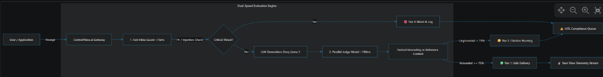

<div align="center">
  
</div>

# ControlPlane.ai 🛡️
> **Model-Agnostic Real-Time AI Oversight, Guardrail & Quality Control Tower**  
> *Developed for the Accenture Innovation Challenge 2026*  
> **Lead Author / Architect:** Tanu Shree

---

## 3. The Solution: ControlPlane.ai

**ControlPlane.ai** is a model-agnostic, real-time control tower that sits between any AI model (OpenAI, Anthropic Claude, Google Gemini, Meta Llama 3 via Groq) and the enterprise applications consuming it.

It continuously scores and protects every interaction across four foundational pillars:
1. **Security & Privacy**: Synchronous PII exfiltration and prompt-injection interception.
2. **Factual Grounding**: Automated Judge Models verifying assertions against reference ground truth (RAG).
3. **Compute Efficiency**: Token meter optimization and dynamic auto-scaling sampling.
4. **Governance & Audit**: Full Human-in-the-Loop (HITL) triage and timestamped compliance export.

### System Architecture Flowchart:
<div align="center">
  
</div>

---

## 4. System Architecture & Deep Dive

### 4.1. The Dual-Speed Evaluation Engine
The core technical breakthrough of ControlPlane.ai is recognizing that **not all guardrails need to run at the same speed**:

| Evaluation Layer | Target Latency | Method | What It Checks | Action Taken |
| :--- | :--- | :--- | :--- | :--- |
| **Stage 1: Fast Inline Guard** | **$<15\text{ ms}$** *(Sync)* | Compiled Regex + Luhn Checksum + Delimiter Scanners | Credit cards, SSNs, API Keys (OpenAI, Groq, AWS), Emails, System Jailbreaks (`"Ignore previous instructions"`) | **Instant Block (Tier 3)** before response generation |
| **Stage 2: Parallel Deep Judge** | **$\sim 180\text{ ms}$** *(Async/Parallel)* | Groq `compound-mini` / Llama 3.1 LLM-as-a-Judge | Factual consistency against retrieved context (RAG), statistical claim verification, toxicity, and bias | **Soft Warning Badge (Tier 2)** attached to output without blocking user |

### 4.2. Dynamic Adaptive Sampling Algorithm
Deep LLM evaluation on 100% of traffic across millions of requests is economically unsustainable. ControlPlane.ai implements an **Adaptive Threat-Triggered Controller**:

```
SampleRate(t) = 
  ├── 25%                                    if AnomalyRate(60s) <= 15%  (Nominal Mode)
  └── min(100%, 25% + alpha * AnomalyRate)   if AnomalyRate(60s) > 15%   (Surge Mode)
```

* **Routine Conditions**: Samples 25% of traffic for deep verification, slashing compute costs by **75%**.
* **Threat Surge / Attack Injections**: Instantly climbs to **85%–100%** inspection depth to form an impenetrable security shield.


---

## 5. Why We Used These Technologies (Design Rationale)

| Component | Selected Technology | Why This Was Chosen over Alternatives |
| :--- | :--- | :--- |
| **Inference Engine** | **Groq Cloud (LPU)** | Provides $<200\text{ms}$ time-to-first-token inference for 70B and 8B models. Enables live LLM-as-a-Judge evaluation in parallel with zero perceivable delay to the end user. |
| **Base & Judge LLMs** | **Meta Llama 3 / Compound Models** | Open-weights, enterprise-safe, with superior reasoning on structured JSON output and factual comparison benchmarks. |
| **Backend Framework** | **FastAPI (Python 3.10+)** | Asynchronous native ASGI framework with built-in Pydantic validation, concurrent background task workers, and high-performance WebSockets. |
| **Real-Time Feed** | **Native WebSockets (`/ws/telemetry`)** | Instant bidirectional push of telemetry logs to the Control Tower UI with sub-millisecond overhead compared to polling. |
| **Frontend Platform** | **React 19 + TypeScript + Vite** | Strict type safety across the entire telemetry data contract, rapid HMR developer experience, and component-level re-rendering optimization. |
| **Design System** | **Tailwind CSS (Dark Obsidian Theme)** | High-contrast, accessibility-compliant executive dark aesthetic (`#07090E`) with light typography and glowing status indicators. |
| **Visual Analytics** | **Recharts** | Declarative, GPU-accelerated SVG charting for OWASP threat distribution and latency histograms. |

---

## 6. Key Features & Capabilities

### 1. 📡 Control Tower (Executive Dashboard)
* **Real-Time KPIs**: Total evaluated volume, critical intercepts blocked, groundedness warnings, and estimated hallucination liability avoided.
* **Dynamic Adaptive Sampling Depth Gauge**: Live visualization of current sampling rate ($25\% \rightarrow 85\%$).
* **OWASP Top 10 for LLMs Threat Distribution**: Breakdown of intercepted injection, privacy, and hallucination incidents.
* **Live Telemetry Stream**: Searchable, filterable real-time event log with 1-click trace inspection.

### 2. `>_` Gateway Lab (Interactive Testing Sandbox)
* **1-Click Live Pitch Presets**:
  * `Customer Payment - Credit Card Exfiltration` (Triggers fast Luhn scanner in $1.2\text{ms}$).
  * `Q3 Financial Advisory - Hallucinated Growth Metric` (Triggers Judge citation warning).
  * `Jailbreak Attack - System Instruction Bypass` (Triggers injection firewall).
  * `Enterprise Policy - Grounded RAG Query` (Clean verified pass).
* **Reference Context Grounding Toggle**: Test custom RAG scenarios against ground truth text.
* **Diagnostics Card**: Step-by-step latency and rationale inspection.

### 3. ⚠️ HITL Incident Queue (Human-in-the-Loop Hub)
* **Incident Review Board**: Triage flagged outputs with complete prompt, response, context, and judge critique data.
* **1-Click Remediation Actions**:
  * 🟢 **Approve & Deliver**: Override false alarms.
  * 🔴 **Reject & Blacklist**: Confirm malicious attack.
  * 🟡 **Redirect to Canned Response**: Safe enterprise fallback.
* **Compliance Audit Exporter**: Download timestamped JSON audit packages for SOC-2/ISO compliance.

### 4. ⚙️ Policy Studio
* Interactive toggles for PII firewalls and prompt injection interceptors.
* Groundedness sensitivity slider ($50\%$ Lenient $\rightarrow 95\%$ Strict Compliance).
* Secure Groq API connection manager (automatically masked and encrypted in `.env`).

---

## 7. OWASP Top 10 for LLMs Mapping

ControlPlane.ai is engineered specifically to address the **OWASP Top 10 for Large Language Model Applications (2025/2026)**:

| OWASP Vulnerability | Vulnerability Name | How ControlPlane.ai Defends Against It |
| :--- | :--- | :--- |
| **LLM01** | **Prompt Injection** | Synchronous heuristic and delimiter analysis stops jailbreak attempts in $<15\text{ms}$. |
| **LLM02** | **Sensitive Information Disclosure** | Regex, Luhn verification, and secret scanners strip/block API keys, credit cards, and SSNs. |
| **LLM03** | **Supply Chain / Hallucination** | Parallel Judge model scores groundedness against verified reference documents. |
| **LLM04** | **Data and Model Poisoning** | HITL audit trail isolates anomalous model outputs and triggers administrative review. |
| **LLM06** | **Excessive Agency** | Dynamic Tiered gating prevents unauthorized downstream execution of unverified commands. |
| **LLM10** | **Unbounded Consumption** | Token metering and adaptive sampling depth caps prevent denial-of-wallet compute spikes. |

---

## 8. Installation & Quick Start Guide

### Prerequisites
* **Python 3.10+** (with `pip`)
* **Node.js 18+** & `npm`
* Modern Web Browser (Chrome, Edge, Firefox, Brave)

---

### Step 1: Clone Repository

```bash
git clone https://github.com/tanu99C/ControlPlane-.ai.git
cd ControlPlane-.ai
```

### Step 2: Configure Environment Variables

Copy the example environment template in the `backend/` directory:
```bash
# Windows (Command Prompt / PowerShell):
copy backend\.env.example backend\.env

# Linux / macOS / Git Bash:
cp backend/.env.example backend/.env
```

Open `backend/.env` and add your Groq API key:
```env
GROQ_API_KEY=gsk_your_groq_api_key_here
DEFAULT_GROQ_MODEL=groq/compound
JUDGE_MODEL=groq/compound-mini
HOST=0.0.0.0
PORT=8000
```
*(Note: A free Groq API key can be generated in 30 seconds at [console.groq.com/keys](https://console.groq.com/keys)).*

---

### Step 3: Run the Application

#### Option A: 1-Click Launchers (Windows)
Simply run the root startup script:
```powershell
.\start_servers.ps1
```
*(Or double-click `start_servers.bat`)*

#### Option B: Manual Cross-Platform Startup (2 Terminals)

**Terminal 1 — Backend (FastAPI Gateway):**
```bash
cd backend

# Create & activate a virtual environment (optional but recommended)
python -m venv venv

# Activate venv:
# Windows (PowerShell): .\venv\Scripts\Activate.ps1
# Windows (Git Bash):   source venv/Scripts/activate
# Linux / macOS:        source venv/bin/activate

# Install dependencies
pip install -r requirements.txt

# Start the server
python -m uvicorn app.main:app --host 0.0.0.0 --port 8000 --reload
```
*Backend runs at: `http://localhost:8000` (Swagger docs: `http://localhost:8000/docs`)*

**Terminal 2 — Frontend (React 19 + Vite):**
```bash
cd frontend

# Install Node packages
npm install

# Start the development server
npm run dev
```
*Frontend runs at: `http://localhost:5173`*

Open **`http://localhost:5173`** in your browser to interact with the Control Tower!


---

## 9. API & Telemetry Reference

### Core Endpoints

#### `POST /api/proxy/evaluate`
Evaluates a user prompt through the universal guardrail gateway.

* **Request Body:**
```json
{
  "prompt": "What was our European division quarterly revenue growth?",
  "context": "Accenture European Markets reported 8.4% constant currency growth for Q3.",
  "application_id": "customer-support-agent"
}
```

* **Response Payload:**
```json
{
  "id": "req-98fa21c4",
  "timestamp": "2026-08-26T12:08:25Z",
  "prompt": "What was our European division quarterly revenue growth?",
  "generated_text": "According to the report, our European division delivered growth of 8.4%.",
  "tier": "SAFE",
  "fast_check": {
    "latency_ms": 1.2,
    "blocked": false,
    "detected_pii": [],
    "is_prompt_injection": false
  },
  "judge_evaluation": {
    "latency_ms": 182.4,
    "groundedness_score": 1.0,
    "is_hallucinated": false,
    "unsupported_claims": [],
    "reasoning": "Every claim in the response is directly supported by the reference context."
  },
  "total_latency_ms": 183.6
}
```

#### `GET /api/telemetry/stats`
Returns aggregated real-time metrics, risk distribution, and sampling rates.

#### `POST /api/simulator/surge`
Dispatches a 5-query attack burst to demonstrate dynamic adaptive sampling auto-climb ($25\% \rightarrow 85\%$).

---


## 10. Scalability & Future Roadmap

* **Q4 2026**: Multi-hop agentic guardrails (autonomous agent tool-call interception).
* **Q1 2027**: Air-gapped on-premise deployment package with vLLM / Ollama sidecars.
* **Q2 2027**: Automated continuous model fine-tuning feedback loop based on HITL rejection logs.

---

## 👥 Authors & Acknowledgements
* **Lead Author / Architect**: Tanu Shree
* **Developed for**: Accenture Innovation Challenge 2026
* **Engineered with**: FastAPI, Groq Cloud LPUs, React 19, and Tailwind CSS.
